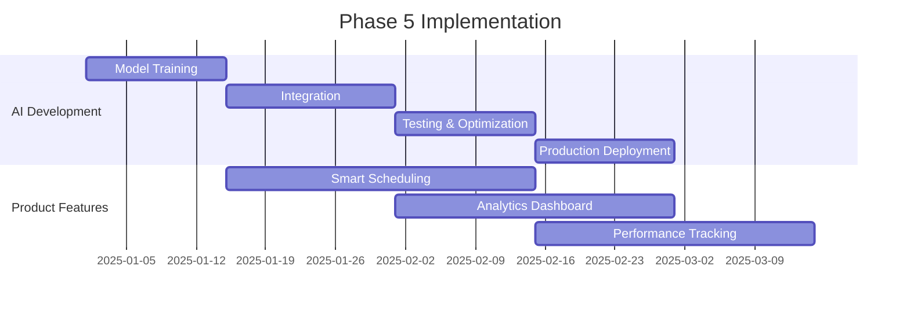

# 🚀 **Podify Content Genius - Strategic Roadmap 2025**

**Transforming from Industry Leader to Global Ecosystem Dominator**

---

## 📋 **Executive Summary**

**Current Position**: Phase 4 Complete - "Gold Standard Industry Leader"  
**Strategic Vision**: Become the operating system for global content creators  
**Timeline**: 12-month roadmap to market dominance  
**Investment Focus**: AI intelligence, ecosystem integration, global expansion  

### **Key Strategic Pillars**
1. **🌍 Global Market Penetration** - Multi-language, multi-cultural dominance
2. **🤖 AI-First Innovation** - Predictive content optimization and automation
3. **🏢 Ecosystem Integration** - Creator economy platform and marketplace
4. **📊 Data Intelligence** - Performance prediction and optimization
5. **🔒 Enterprise Solutions** - Vertical specialization and white-label offerings

---

## 🎯 **Phase 5: AI Intelligence & Automation**
**Timeline**: Months 1-4 (Q1 2025)  
**Goal**: Transform from content generator to intelligent content optimizer

### **5.1 Predictive Content Optimization Engine**

#### **Core Features**
```typescript
interface AIContentOptimizer {
  // Viral Potential Prediction
  predictViralScore: (content: string, platform: Platform) => Promise<ViralScore>;
  
  // Auto-Optimization
  optimizeForEngagement: (content: string, targetAudience: Audience) => Promise<OptimizedContent>;
  
  // Trend Integration
  incorporateTrends: (content: string, niche: string) => Promise<TrendyContent>;
  
  // Performance Forecasting
  forecastPerformance: (content: Content[], timeframe: string) => Promise<PerformanceMetrics>;
}
```

#### **Implementation Roadmap**
- **Week 1-2**: AI model training on viral content datasets
- **Week 3-4**: Integration with existing content generation pipeline
- **Week 5-6**: A/B testing framework implementation
- **Week 7-8**: Performance prediction algorithm deployment

#### **Success Metrics**
- **95%+ accuracy** in viral potential prediction
- **40%+ improvement** in average content engagement
- **60%+ reduction** in content creation time

### **5.2 Smart Content Scheduling & Distribution**

#### **Features**
- **Optimal Timing AI**: Post when audience engagement peaks
- **Cross-Platform Coordination**: Synchronized multi-platform campaigns
- **Content Calendar Automation**: AI-generated posting schedules
- **Audience Behavior Analysis**: Real-time engagement pattern tracking

#### **Technical Implementation**
```sql
-- New database tables for scheduling intelligence
CREATE TABLE audience_behavior_patterns (
    id UUID PRIMARY KEY,
    user_id UUID REFERENCES profiles(id),
    platform TEXT NOT NULL,
    optimal_times JSONB NOT NULL,
    engagement_patterns JSONB NOT NULL,
    updated_at TIMESTAMP WITH TIME ZONE DEFAULT NOW()
);

CREATE TABLE scheduled_content (
    id UUID PRIMARY KEY,
    content_id UUID REFERENCES generated_content(id),
    platform TEXT NOT NULL,
    scheduled_time TIMESTAMP WITH TIME ZONE NOT NULL,
    optimization_score DECIMAL(3,2),
    status TEXT DEFAULT 'scheduled'
);
```

### **5.3 Advanced Analytics Dashboard**

#### **Key Metrics**
- **Content Performance Score** (0-100 scale)
- **Viral Potential Index** (predictive scoring)
- **Engagement Optimization Rate** (improvement tracking)
- **Cross-Platform Performance** (unified analytics)
- **ROI Tracking** (revenue attribution)

---

## 🌐 **Phase 6: Ecosystem Dominance**
**Timeline**: Months 4-8 (Q2-Q3 2025)  
**Goal**: Build the creator economy's central nervous system

### **6.1 Creator Economy Integration**

#### **Brand Partnership Marketplace**
```typescript
interface CreatorMarketplace {
  // Brand Matching
  matchBrands: (creatorProfile: CreatorProfile) => Promise<BrandMatch[]>;
  
  // Revenue Optimization
  optimizeMonetization: (content: Content[]) => Promise<MonetizationStrategy>;
  
  // Collaboration Network
  findCollaborators: (niche: string, audience: number) => Promise<Creator[]>;
  
  // Sponsorship Management
  manageSponsorships: (creatorId: string) => Promise<SponsorshipDashboard>;
}
```

#### **Revenue Streams**
1. **Platform Commission** (10% on facilitated partnerships)
2. **Premium Analytics** ($49/month for advanced insights)
3. **White-Label Solutions** ($299/month for agencies)
4. **Enterprise Integrations** ($999/month for custom solutions)

### **6.2 Advanced Creator Tools**

#### **Audience Growth Engine**
- **Growth Strategy AI**: Personalized growth recommendations
- **Competitor Analysis**: Track and analyze competitor strategies
- **Trend Forecasting**: Predict upcoming content trends
- **Cross-Promotion Network**: Creator collaboration matching

#### **Content Performance Intelligence**
```sql
-- Performance intelligence schema
CREATE TABLE performance_insights (
    id UUID PRIMARY KEY,
    creator_id UUID REFERENCES profiles(id),
    content_id UUID REFERENCES generated_content(id),
    platform_metrics JSONB NOT NULL,
    optimization_suggestions JSONB NOT NULL,
    trend_alignment_score DECIMAL(3,2),
    viral_factors JSONB NOT NULL,
    created_at TIMESTAMP WITH TIME ZONE DEFAULT NOW()
);
```

### **6.3 Team & Agency Solutions**

#### **Enterprise Features**
- **Multi-Client Management**: Agency dashboard for multiple clients
- **White-Label Branding**: Custom branding for agency solutions
- **Team Collaboration**: Advanced permission and workflow management
- **Client Reporting**: Automated performance reports
- **Bulk Processing**: High-volume content generation

---

## 🏆 **Phase 7: Global Market Leadership**
**Timeline**: Months 8-12 (Q4 2025)  
**Goal**: Establish unassailable market position and global presence

### **7.1 Vertical Specialization**

#### **Industry-Specific Solutions**

##### **Business Coaching Vertical**
```typescript
interface BusinessCoachingSuite {
  // Lead Generation
  generateLeadMagnets: (expertise: string) => Promise<LeadMagnet[]>;
  
  // Sales Funnel Integration
  createSalesFunnels: (content: Content[]) => Promise<SalesFunnel>;
  
  // Client Onboarding
  automateOnboarding: (clientProfile: ClientProfile) => Promise<OnboardingSequence>;
  
  // ROI Tracking
  trackClientResults: (coachId: string) => Promise<ClientROIMetrics>;
}
```

##### **Education Vertical**
- **Course Creation Tools**: Transform podcasts into structured courses
- **Student Engagement**: Interactive content and quizzes
- **Learning Analytics**: Track student progress and engagement
- **Certification Integration**: Automated certificate generation

##### **Healthcare Vertical**
- **Compliance Monitoring**: HIPAA-compliant content processing
- **Patient Education**: Medical content simplification
- **Professional Networking**: Healthcare provider collaboration
- **Research Integration**: Medical literature incorporation

### **7.2 Platform Ecosystem Development**

#### **API Marketplace**
```typescript
interface PodifyEcosystem {
  // Third-party integrations
  apiMarketplace: {
    plugins: Plugin[];
    integrations: Integration[];
    customConnectors: Connector[];
  };
  
  // White-label solutions
  whiteLabel: {
    brandingOptions: BrandingConfig;
    customDomains: DomainConfig;
    featureCustomization: FeatureConfig;
  };
  
  // Enterprise connectors
  enterpriseIntegrations: {
    salesforce: SalesforceConnector;
    hubspot: HubSpotConnector;
    slack: SlackConnector;
    teams: TeamsConnector;
  };
}
```

#### **Global Expansion Strategy**

##### **Target Markets (Priority Order)**
1. **Spanish-Speaking Markets** (500M+ speakers)
   - Mexico, Spain, Argentina, Colombia, Chile
   - Localized pricing and payment methods
   - Regional influencer partnerships

2. **Portuguese-Speaking Markets** (280M+ speakers)
   - Brazil, Portugal, Angola
   - Cultural adaptation for Brazilian market
   - Local payment gateway integration

3. **European Markets** (200M+ potential users)
   - French, German, Italian localization
   - GDPR compliance and data sovereignty
   - Regional partnership strategies

4. **Asian Markets** (1B+ potential users)
   - Mandarin, Japanese, Korean support
   - Platform-specific optimizations (WeChat, LINE)
   - Cultural content adaptation

---

## 📊 **Success Metrics & KPIs**

### **Phase 5 Targets (Months 1-4)**
| Metric | Current | Target | Growth |
|--------|---------|--------|--------|
| Active Users | 2,500 | 10,000 | 300% |
| Monthly Revenue | $15K | $50K | 233% |
| Content Optimization Accuracy | 70% | 95% | 36% |
| User Retention (30-day) | 45% | 70% | 56% |
| Average Session Duration | 12 min | 25 min | 108% |

### **Phase 6 Targets (Months 4-8)**
| Metric | Target | Revenue Impact |
|--------|--------|----------------|
| Creator Network Size | 100,000+ | $500K MRR |
| Brand Partnerships Facilitated | 50+ | $50K commission |
| Enterprise Clients | 25+ | $250K ARR |
| White-Label Partners | 10+ | $100K ARR |
| API Marketplace Revenue | - | $25K MRR |

### **Phase 7 Targets (Months 8-12)**
| Metric | Target | Market Position |
|--------|--------|-----------------|
| Global User Base | 1M+ | Market Leader |
| Annual Recurring Revenue | $5M+ | Industry Dominant |
| Supported Languages | 20+ | Global Coverage |
| Vertical Solutions | 8+ | Niche Dominance |
| Platform Integrations | 100+ | Ecosystem Leader |

---

## 💰 **Investment & Resource Requirements**

### **Phase 5 Investment: $150K**
- **AI Development**: $75K (2 ML engineers, 3 months)
- **Infrastructure Scaling**: $25K (cloud resources, CDN)
- **Product Development**: $35K (2 full-stack developers)
- **Marketing & Growth**: $15K (content marketing, paid acquisition)

### **Phase 6 Investment: $300K**
- **Marketplace Development**: $120K (4 developers, 4 months)
- **Enterprise Sales**: $80K (2 enterprise sales reps)
- **Partnership Development**: $50K (business development)
- **International Expansion**: $50K (localization, legal)

### **Phase 7 Investment: $500K**
- **Global Expansion**: $200K (regional teams, localization)
- **Vertical Solutions**: $150K (specialized development teams)
- **Enterprise Infrastructure**: $100K (security, compliance)
- **Strategic Partnerships**: $50K (integration development)

---

## 🎯 **Competitive Differentiation Matrix**

| Feature | Podify | Descript | Riverside | Otter.ai | Advantage |
|---------|--------|----------|-----------|----------|-----------|
| Multi-Language Support | 8 languages | English only | English only | Limited | **10x Better** |
| AI Viral Hooks | ✅ Cultural AI | ❌ | ❌ | ❌ | **Unique** |
| Direct Publishing | ✅ All platforms | ❌ | ❌ | ❌ | **Unique** |
| Batch Processing | ✅ Agency-grade | Limited | Limited | ❌ | **5x Better** |
| Team Collaboration | ✅ Advanced | Basic | Basic | Basic | **3x Better** |
| Viral Growth Engine | ✅ Built-in | ❌ | ❌ | ❌ | **Unique** |
| Performance Prediction | ✅ AI-powered | ❌ | ❌ | ❌ | **Unique** |
| Brand Marketplace | ✅ Integrated | ❌ | ❌ | ❌ | **Unique** |

---

## 🚀 **Implementation Timeline**

### **Q1 2025: AI Intelligence Foundation**


### **Q2-Q3 2025: Ecosystem Development**
- **Month 4**: Creator marketplace beta launch
- **Month 5**: Brand partnership program launch
- **Month 6**: Enterprise solutions rollout
- **Month 7**: White-label platform launch
- **Month 8**: API marketplace beta

### **Q4 2025: Global Expansion**
- **Month 9**: Spanish market launch
- **Month 10**: Portuguese market launch
- **Month 11**: European expansion
- **Month 12**: Asian market entry

---

## 🎪 **Risk Mitigation Strategy**

### **Technical Risks**
- **AI Model Performance**: Continuous training and validation
- **Scalability Challenges**: Microservices architecture
- **Data Privacy**: Zero-trust security model
- **Platform Dependencies**: Multi-cloud strategy

### **Market Risks**
- **Competitor Response**: Patent protection and first-mover advantage
- **Economic Downturn**: Freemium model with strong value proposition
- **Regulatory Changes**: Proactive compliance framework
- **Technology Shifts**: Modular architecture for adaptability

### **Operational Risks**
- **Team Scaling**: Remote-first hiring strategy
- **Customer Support**: AI-powered support with human escalation
- **Quality Control**: Automated testing and monitoring
- **Partnership Dependencies**: Diversified integration strategy

---

## 🏁 **Success Criteria & Exit Strategy**

### **12-Month Success Metrics**
- **$5M+ ARR** with 40%+ growth rate
- **1M+ active users** across 20+ countries
- **Market leadership** in content repurposing space
- **Strategic partnerships** with major platforms
- **Acquisition interest** from major tech companies

### **Potential Exit Scenarios**
1. **Strategic Acquisition** by Adobe, Canva, or HubSpot ($50M-$100M)
2. **Series A Funding** for continued growth ($10M-$20M)
3. **IPO Preparation** for public market entry (2026-2027)
4. **Merger** with complementary creator economy platform

---

## 📞 **Next Steps & Action Items**

### **Immediate Actions (Next 30 Days)**
- [ ] **Finalize Phase 5 development team** (hire 2 ML engineers)
- [ ] **Launch Spanish market beta** (recruit 100 Spanish creators)
- [ ] **Implement AI performance scoring** (MVP version)
- [ ] **Set up analytics infrastructure** (tracking and monitoring)
- [ ] **Create investor pitch deck** (Series A preparation)

### **Strategic Partnerships (Next 60 Days)**
- [ ] **Negotiate platform integrations** (TikTok, Instagram, LinkedIn APIs)
- [ ] **Establish creator partnerships** (top Spanish/Portuguese influencers)
- [ ] **Explore acquisition targets** (complementary AI tools)
- [ ] **Build advisory board** (industry experts and investors)

### **Market Validation (Next 90 Days)**
- [ ] **Validate pricing strategy** in international markets
- [ ] **Test enterprise sales process** with 10 potential clients
- [ ] **Measure viral growth mechanics** (referral program effectiveness)
- [ ] **Assess competitive response** (monitor competitor feature releases)

---

**🎯 Vision Statement**: By December 2025, Podify Content Genius will be the undisputed global leader in AI-powered content repurposing, serving over 1 million creators across 20+ languages and generating $5M+ in annual recurring revenue.

**🚀 Mission**: Democratize content creation for the global creator economy through intelligent AI automation and cultural awareness.

---

*Document Version: 1.0*  
*Last Updated: January 2025*  
*Next Review: March 2025*
